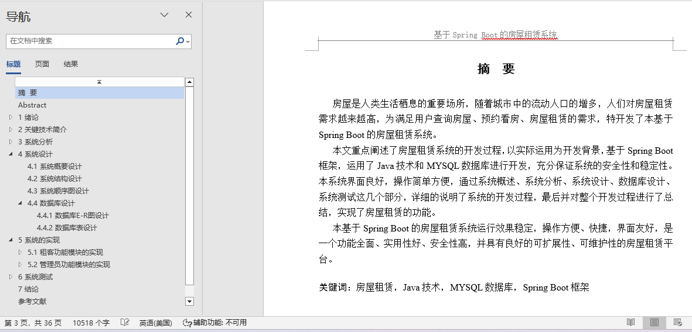
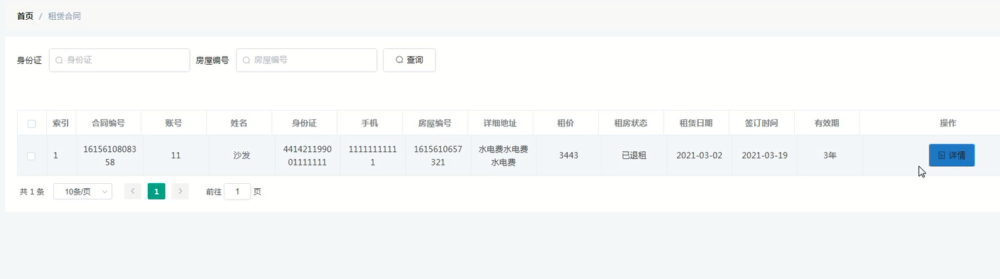
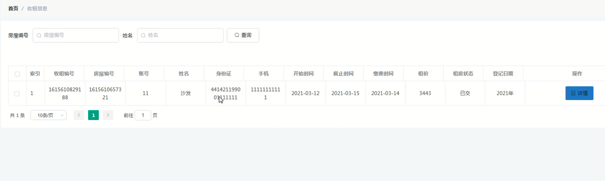
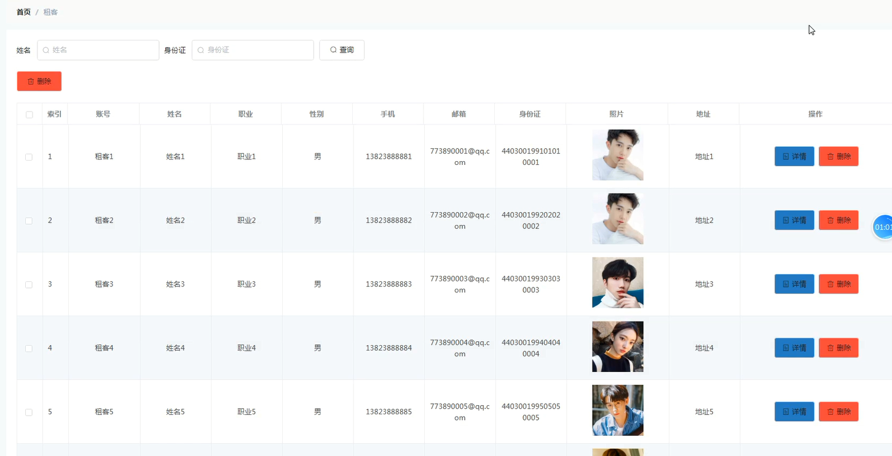
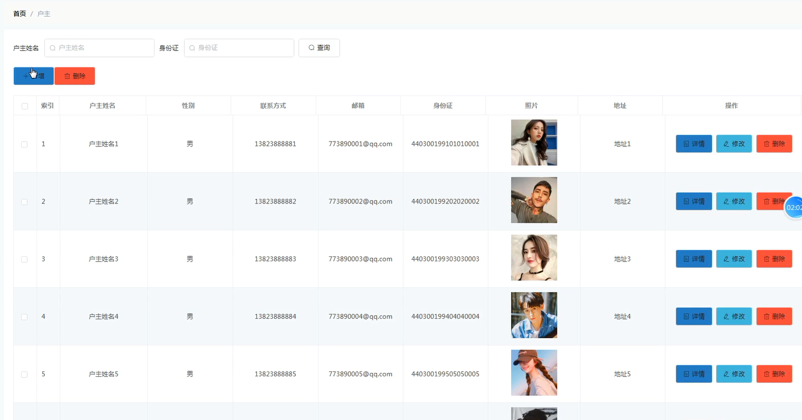
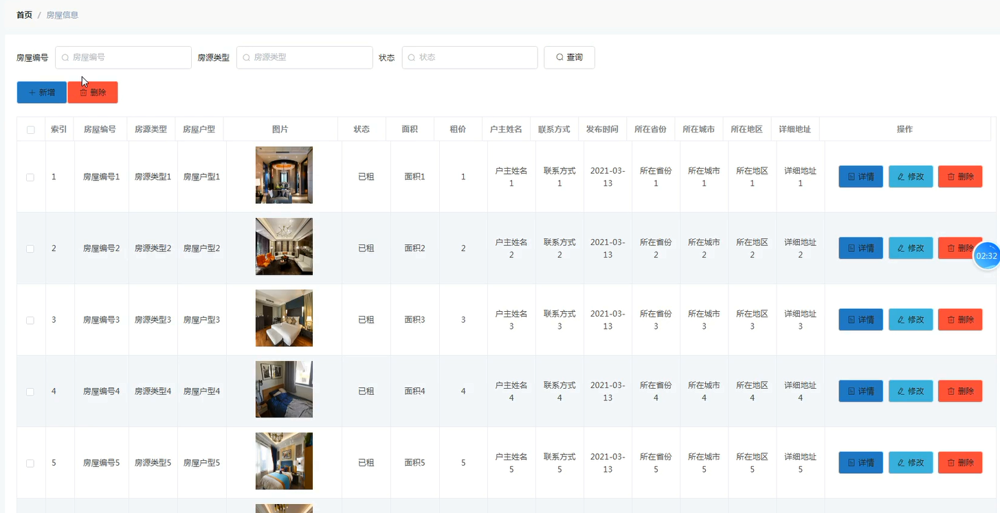
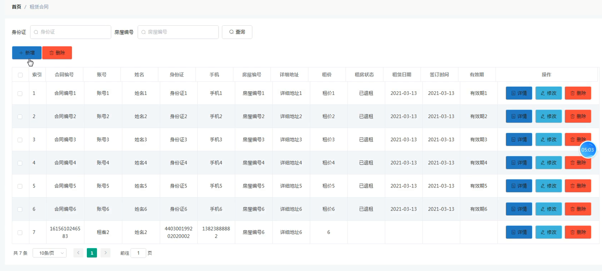

## 基于springboot的房屋租赁系统(程序+报告)

- <b>完整代码获取地址：从戎源码网 ([https://armycodes.com/](https://armycodes.com/))</b>
- <b>技术探讨、资料分享，请加QQ群：692619798</b> 
- <b>作者微信：19941326836  QQ：952045282</b> 
- <b>承接计算机毕业设计、Java毕业设计、Python毕业设计、深度学习、机器学习</b>
- <b>选题+开题报告+任务书+程序定制+安装调试+论文+答辩ppt 一条龙服务</b>
- <b>所有选题地址 ([https://github.com/YuLin-Coder/AllProjectCatalog](https://github.com/YuLin-Coder/AllProjectCatalog)) </b>

## 项目介绍
基于springboot的房屋租赁系统，系统包含两种角色：用户、管理员，系统分为前台和后台两大模块，主要功能如下：

1 租客功能模块的实现

系统主界面  
租客登录后进入系统主界面，可以查看首页公告信息以及房屋信息等内容。  

租客注册界面  
未注册的租客可以通过注册界面进行注册操作。  

租客登录界面  
租客可以在登录界面输入账号和密码进行登录系统。  

房屋详情界面  
租客可以选择具体的房屋查看详细信息，并可以进行看房申请操作。  

看房申请界面  
租客在登录后选择房屋进行看房申请，填写相关信息进行申请。  

租赁合同界面  
租客登录后可以查看租赁合同的详细信息。  

收租信息界面  
租客可以查看收租相关的信息，了解租金的收取情况。  

2 管理员功能模块的实现

管理员登录界面  
管理员需登录系统后台才能进行管理操作，输入用户名和密码进行系统登录。  

租客管理界面  
管理员可以查看、修改和删除租客的信息。  

户主管理界面  
管理员可以查看现有的户主信息，进行编辑、删除或添加户主信息。  

房屋信息管理界面  
管理员可以进行房屋信息的增删改查操作。  

看房申请管理界面  
管理员可以查看用户的看房申请信息，并进行审核操作。  

租赁合同管理界面  
管理员可以增删改查租赁合同的信息。  

收租信息管理界面  
管理员可以添加、修改和删除收租相关的信息。

## 项目技术
- 编程语言：Java
- 数据库：MySQL
- 项目管理工具：Maven
- 前端技术：HTML、CSS、JavaScript、Jquery、Vue
- 后端技术：Spring、SpringMVC、MyBatis

## 运行环境
- JDK版本：JDK1.8及以上
- 开发工具：IDEA、Ecplise、Myecplise都可以
- 数据库: MySQL5.7及以上
- Maven：maven3.0及以上
- Node：14.14.0及以上

## 运行截图

